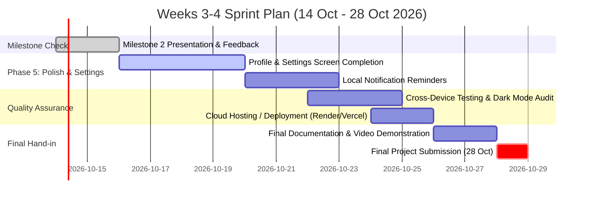

# DV300 – Theme 4: AI-Driven Application
## Milestone 2 Check Documentation & Technical Report

* **Student Name**: Francois le Roux
* **Student Number**: 231256
* **Project Name**: SymptomJournal
* **Focus Area**: Healthcare AI Application
* **Tech Stack**: React Native (Expo, TypeScript) / FastAPI (Python 3.13) / Supabase (PostgreSQL) / Llama-3.2 (NVIDIA API)
* **Milestone Date**: 14 October 2026
* **Final Hand-in Date**: 28 October 2026

---

## 📋 1. Scope Confirmation (Must / Nice / Future)

The MVP scope was established during the pitch and frozen for the 2-week check. Below is the updated feature classification:

| Priority | Feature | Status | Description / Reason |
| :--- | :--- | :---: | :--- |
| **Must-Have** | **User Authentication & Session Management** | ✅ Completed | Supabase JWT authentication (sign-up, sign-in, session recovery, ES256/HS256 support). |
| **Must-Have** | **Structured Symptom Logging** | ✅ Completed | 3×2 category grid (Pain, Fatigue, Mood, Digestion, Breathing, Skin), 1–10 severity slider, body areas, onset presets, triggers, and notes. |
| **Must-Have** | **Chronological Symptom Timeline** | ✅ Completed | Calendar view with date indicators, category filter tabs, and relative date grouping. |
| **Must-Have** | **AI Pattern Recognition Engine** | ✅ Completed | Identifies time-of-day clusters, trigger correlations, and frequency patterns with 3-entry minimum lock. |
| **Must-Have** | **Clinical Doctor Summary & PDF Export** | ✅ Completed | Formatted report generation with native mobile PDF compilation and system share/print dialog. |
| **Must-Have** | **AI Medication & Health Assistant** | ✅ Completed | Real LLM conversational chat with clinical prompt guardrails and floating quick-access button. |
| **Nice-to-Have**| **Today's Wellness Dynamic Score** | ✅ Completed | Automated algorithm computing a 0–100 wellness score based on frequency, active days, and severities. |
| **Nice-to-Have**| **Swagger UI Interactive Auth Endpoints** | ✅ Completed | Added `/auth/signup` and `/auth/login` to FastAPI to facilitate live testing in Swagger UI. |
| **Future Scope**| **Local Push Reminders** | ⏳ Phase 5 | Scheduled check-in reminders ("How are you feeling today?"). |
| **Future Scope**| **Biometric Face ID / Touch ID Lock** | ⏳ Phase 5 | Optional security layer for sensitive medical notes. |
| **Future Scope**| **Cloud Cloudflare / Render Deployment** | ⏳ Phase 5 | Public production hosting for final submission. |

---

## ⚡ 2. Technical Risks & Challenges Encountered

During development, several real engineering hurdles were encountered and resolved:

### 1. Supabase Modern JWT Algorithm (`ES256` vs. `HS256`)
* **The Challenge**: When testing backend endpoints via Swagger UI and Axios, tokens were rejected with `401 Unauthorized: The specified alg value is not allowed`. Supabase Auth recently modernized its default signing algorithm to asymmetric `ES256` (Elliptic Curve ECDSA), whereas standard backend decoders expected symmetric `HS256`.
* **How It Was Solved**: Refactored [`auth_service.py`](file:///c:/Users/flr21/Desktop/SymptomJournal/backend/services/auth_service.py) into a multi-tiered verification pipeline. It first validates the token directly through Supabase Auth API (`supabase.auth.get_user(token)`), supporting all algorithm variations, with a resilient cryptographic fallback decoding `ES256`, `RS256`, and `HS256`.

### 2. Relational Foreign Key Synchronization (`auth.users` vs `public.users`)
* **The Challenge**: When newly authenticated users attempted to log symptoms, PostgreSQL returned a `23503 foreign key constraint violation` (`user_id is not present in table "users"`). Supabase maintains authentication records in the internal `auth.users` schema, while relational symptom tables reference `public.users`.
* **How It Was Solved**: Created an automated profile synchronization function (`ensure_user_profile`) in the backend authentication middleware. Whenever an authenticated request arrives, the backend transparently verifies and upserts the profile record in `public.users`, completely eliminating foreign key errors.

### 3. Android Scoped Storage & PDF Export Sandbox
* **The Challenge**: On Android devices (particularly within Expo Go), invoking `ExpoSharing.shareAsync` on cached PDF files threw: `Not allowed to read file under given URL` due to Android's strict scoped storage security policies.
* **How It Was Solved**: Re-engineered [`pdf-export.ts`](file:///c:/Users/flr21/Desktop/SymptomJournal/frontend/src/lib/pdf-export.ts) with a dual-execution strategy. It attempts native file sharing with proper MIME/UTI configurations (`com.adobe.pdf`), and automatically falls back to `Print.printAsync({ html })`, which opens Android's native Print / "Save as PDF" service without requiring broad storage permissions.

### 4. Preventing Medical AI Hallucinations & Prescriptions
* **The Challenge**: LLMs are prone to offering speculative medical diagnoses or recommending unverified medication dosages if unconstrained.
* **How It Was Solved**: Implemented strict prompt engineering and data guards in [`ai_service.py`](file:///c:/Users/flr21/Desktop/SymptomJournal/backend/services/ai_service.py). The prompt mandates third-person phrasing, prohibits definitive diagnostic claims, requires calm educational language, and enforces a mandatory clinical disclaimer. Furthermore, numerical metrics (e.g. average severities and frequencies) are computed deterministically in Python/SQL rather than by the LLM.

### 5. LAN vs. Tunnel IP Dynamic Reachability
* **The Challenge**: Mobile devices running Expo Go over local Wi-Fi lost connection (`AxiosError: Network Error`) whenever the development host computer was assigned a new local DHCP IP address upon reconnecting.
* **How It Was Solved**: Standardized `.env` configuration workflows and verified endpoint accessibility across LAN and Expo tunnels (`--tunnel`), ensuring quick IP updates and cache invalidation.

---

## 🤖 3. AI Reliability & Prompt Engineering Architecture

### Core AI Pipelines:

#### A. Symptom Pattern Recognition (`/analysis/patterns`)
* **Minimum Threshold**: Requires $\ge 3$ logs before invoking the LLM. If $< 3$, returns a structured progress state (`{ "ready": false, "entries_count": X }`).
* **Output Format**: Strictly constrained to a JSON schema containing `most_frequent_symptom`, `key_findings`, `time_pattern`, and `suggestion`.
* **Fence Stripping**: Backend utilizes `_strip_json_fences()` regex parsing to strip markdown syntax fences (` ```json `), preventing JSON decode exceptions.

#### B. Doctor Appointment Summary (`/analysis/summary`)
* **Context Assembly**: Aggregates up to 30 recent symptom entries with timestamps, severities, and associated triggers.
* **Sections Generated**:
  1. *Patient Report Overview*
  2. *Most Frequent Symptoms*
  3. *Patterns & Clinical Notes*
  4. *Questions to Discuss with Doctor*

#### C. AI Medication Assistant (`/analysis/chat`)
* **Context Window**: Maintains conversational history up to 6 previous dialogue turns.
* **Safety Rules**: Provides factual drug information (uses, general dosage precautions, common side effects) accompanied by instructions to consult licensed medical professionals.

---

## 🧪 4. Testing & Usability Log

### Automated Test Suite (Backend):
* **Framework**: `pytest`
* **Coverage**: **40 passing automated tests** across:
  * `test_auth.py`: Token verification, validation constraints, and profile sync.
  * `test_symptoms.py`: Symptom creation, severity bounds (1–10), time-of-day constraints, trigger schemas, and history retrieval.
  * `test_ai_service.py`: LLM mocking, JSON fence stripping, fallback recovery, and chat completions.

### Informal Usability Test:
* **Participant**: Independent tester / peer.
* **Task 1 (Logging)**: Log a headache with severity 6, trigger "Poor Sleep", and time "now".
  * *Feedback*: Category icons and severity slider were intuitive; logging completed in $< 15$ seconds.
* **Task 2 (Reviewing & Exporting)**: View Timeline and tap "Export PDF" on the Doctor Summary screen.
  * *Feedback*: Liked the calendar indicators on the Timeline and the formatted PDF report layout.
* **Action Taken**: Adjusted bottom navigation safe-area insets to ensure buttons are never obscured by Android navigation bars.

---

## 📅 5. Sprint Plan for Weeks 3–4 (Leading to Final Submission on 28 Oct)



### Detailed Deliverables for Weeks 3–4:
1. **Week 3 (15–21 Oct)**: Complete Profile settings (edit profile, notification preferences), implement local push check-in reminders, and incorporate feedback from the Milestone 2 check.
2. **Week 4 (22–28 Oct)**: Cloud deployment of FastAPI backend (Render / Railway), final end-to-end regression testing, final pitch slide polish, and video demo recording for submission on 28 October.
